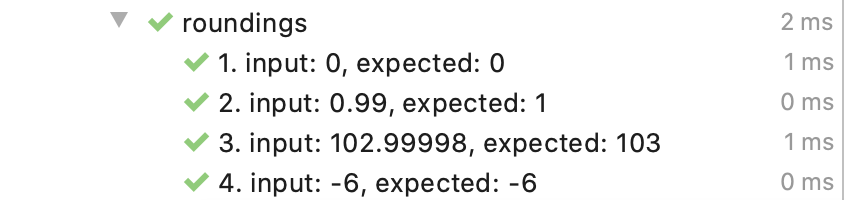

# jest-test-each

This package will help you to run parametrised tests easily [typesafe] without text tables or arrays of arrays.


[](https://github.com/mmisty/jest-test-each/watchers)

## Table of Contents

1. [Examples](#examples)
2. [Setup](#setup)
3. [Features](#features)
4. [What's next](#whats-next)

## Examples

### Simple

```typescript
its('roundings')
  .each([
    { input: 0, expected: '0' },
    { input: 0.99, expected: '1' },
    { input: 102.99998, expected: '103' },
    { input: -6, expected: '-6' },
  ])
  .run(t => {
    expect(Math.round(t.input).toFixed(0)).toBe(t.expected);
  });
```

Run test in idea with jest plugin:



### More complex

```typescript
its('check calculator')
  .each([
    { a: 1, b: 2, exp: [3, -1, 2, 0.5] },
    { a: 1, b: 0, exp: [1, 1, 0, Infinity] },
  ])
  .each(t => [
    { sign: '+' as const, exp: t.exp[0] },
    { sign: '-' as const, exp: t.exp[1] },
    { sign: '*' as const, exp: t.exp[2] },
    { sign: '/' as const, exp: t.exp[3] },
  ])
  .each(t => [{ flatDesc: `${t.a} ${t.sign} ${t.b} should be ${t.exp}` }])
  .run(async t => {
    expect(calc(t.a, t.b, t.sign)).toBe(t.exp);
  });
```


and the same test with auto cases names:


## Setup

Install dev dependency:

```
yarn add -D jest-test-each
```

Add the following into your setupFilesAfterEnv config jest.setup.js file:

```
require('jest-test-each');
```

Looking a way to improve this. Can anyone help ?)

for .ts tests to see globals 'its' and 'Test' add the following to your tsconfig:

```
// tsconfig.json
 "include": [
    ...
    "node_modules/jest-test-each/dist/index.d.ts"
  ]
```

#### Additional

You can override test runner environment (by default it is jest env) by the following:

```javascript
TestEachEnv({
  suiteRunner: describe,
  testRunner: it,
  beforeAll: beforeAll,
  ...
});
```

## Features

- [x] cases multiplication (`.each().each()....run()`)
- [x] ability to setup test-each:
  - number cases or not
  - group each level by suite or not
- [x] ability to setup test runner environment (by default it is jest)
- [x] ability to specify description for each case as function depending on case args
- [x] ability to create .each level depending on previous
- [x] ability to have flat tests cases (not groupped) when each case has 'flatDesc'
- [x] global var 'Test' (or 'its' alias) to access test each (I'm accepting suggestions on namings)
- [ ] To run one test from TestEach like it.only (**workaround**: commenting cases/filtering)
- [ ] To start testEach by Idea plugin (**workaround**: wrap with describe and do not put name into Test Each)

## What's next

- [ ] add '.before' to testEach with disposable interface for automatic cleanup
- [ ] do not create suite wrapping when only one test in the group
- [ ] ability to run without single .each (`its().run(..)`)
